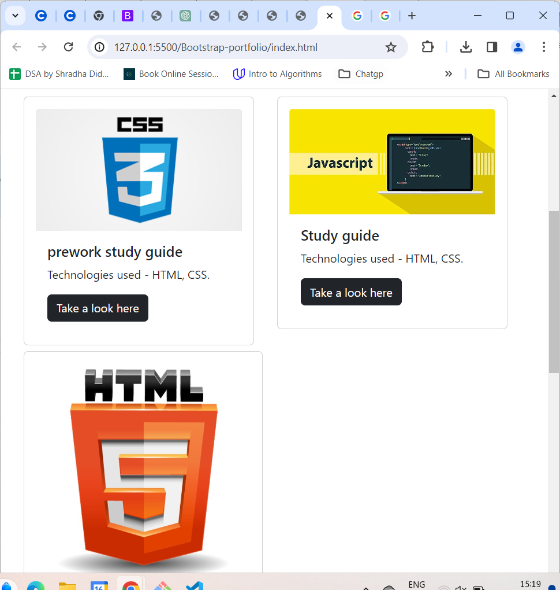

# Bootstrap-portfolio
# Bootstrap-Portfolio
Welcome to my portfolio!

## Description

- This is my portfolio that provides my basic information about myself, projects I worked on with the deployed live site links on click of tiles and contact information. This is very basic web application developed using technologies HTML and CSS.
- Here is the screenshot of Bootstrap-Portfolio website.

## Live site link
Here is the link of deployed website
[Bootstrap-Portfolio]

## Github repo link
Here is the link of Github repo
[Github repo](https://github.com/Richard105247908/Bootstrap-portfolio)

## Installation

Clone the repository from github to your local using HTTPS or SSH or Github CLI and then run it in local.

## Usage
N/A

## Credits

N/A

## License

[MIT](https://choosealicense.com/licenses/mit/)

## Badges

N/A

## Features

N/A

## How to Contribute

N/A

## Tests

N/A